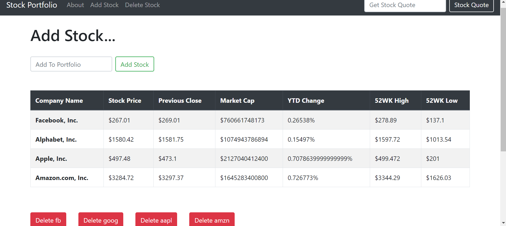

# Stock Market Portfolio Web Application

# Features
* Add stock
* Delete stock
* Search stock
* User-friendly.
* etc,.....

# Tools
## Front-end Part
* HTML
* CSS
* Bootstrap
## Back-end
* Django
* SQLite 3

# Screenshots of the Project

  
  

**Copyright (c)** 2020-3020 Md. Omar Faruk

## Go Through This Site Then You Will Know About This Site Properly.
